# **企业网网络设计**

### 一、拓扑搭建


### 二、内网搭建——修改设备名称

```PowerShell
sy
sysname HX-SW01
<Huawei>system-view //进入系统试图
[Huawei]sysname HJ-SW01 //修改设备名称
```

### 三、内网搭建——链路聚合

```PowerShell
sy
interface Eth-Trunk 1
port link-type trunk 
port trunk allow-pass vlan all  
mode lacp
q
interface GigabitEthernet 0/0/23
eth-trunk 1
interface GigabitEthernet 0/0/24
eth-trunk 1
<HJ-SW01>sy //进入系统视图
[HJ-SW01]interface Eth-Trunk 1 //创建eth 1聚合接口
[HJ-SW01-Eth-Trunk1]port link-type trunk //设置端口类型为trunk
[HJ-SW01-Eth-Trunk1]port trunk allow-pass vlan all //设置允许所有vlan通过
[HJ-SW01-Eth-Trunk1]mode lacp //启用lacp动态聚合协议
[HJ-SW01-Eth-Trunk1]q
[HJ-SW01]interface GigabitEthernet 0/0/23 
[HJ-SW01-GigabitEthernet0/0/23]eth-trunk 1 //加入聚合组1
[HJ-SW01]interface GigabitEthernet 0/0/24
[HJ-SW01-GigabitEthernet0/0/24]eth-trunk 1
//检测结果
[HJ-SW01]display eth-trunk 1
Eth-Trunk1's state information is:
Local:
LAG ID: 1                   WorkingMode: STATIC                               
Preempt Delay: Disabled     Hash arithmetic: According to SIP-XOR-DIP         
System Priority: 32768      System ID: 4c1f-cc3a-7124                         
Least Active-linknumber: 1  Max Active-linknumber: 8                          
Operate status: up          Number Of Up Port In Trunk: 2                     
--------------------------------------------------------------------------------
ActorPortName          Status   PortType PortPri PortNo PortKey PortState Weight
GigabitEthernet0/0/23  Selected 1GE      32768   24     305     10111100  1     
GigabitEthernet0/0/24  Selected 1GE      32768   25     305     10111100  1     

Partner:
--------------------------------------------------------------------------------
ActorPortName          SysPri   SystemID        PortPri PortNo PortKey PortState
GigabitEthernet0/0/23  32768    4c1f-cc02-7d1c  32768   24     305     10111100
GigabitEthernet0/0/24  32768    4c1f-cc02-7d1c  32768   25     305     10111100
```

### 四、内网搭建——vlan接入

接入终端的地方配置access

交换机和交换机之间配置trunk（并允许所有vlan）

```PowerShell
vlan batch 80 100
interface Ethernet 0/0/3
port link-type access 
port default vlan 80

vlan batch 10 20 30 40 50 60 70 80 100
[JR-SW01]vlan batch 10 100
[JR-SW01]interface Ethernet 0/0/3
[JR-SW01-Ethernet0/0/3]port link-type access 
[JR-SW01-Ethernet0/0/3]port default vlan 10
interface Ethernet 0/0/1
port link-type trunk 
port trunk allow-pass vlan all 
interface Ethernet 0/0/2
port link-type trunk
port trunk allow-pass vlan all

port-group group-member GigabitEthernet 0/0/1 to GigabitEthernet 0/0/6
port link-type trunk 
port trunk allow-pass vlan all

port-group group-member GigabitEthernet 0/0/1 to GigabitEthernet 0/0/4        
port link-type trunk 
port trunk allow-pass vlan all
[JR-SW01]interface Ethernet 0/0/1
[JR-SW01-Ethernet0/0/1]port link-type trunk 
[JR-SW01-Ethernet0/0/1]port trunk allow-pass vlan all 
[JR-SW01-Ethernet0/0/1]interface Ethernet 0/0/2
[JR-SW01-Ethernet0/0/2]port link-type trunk
[JR-SW01-Ethernet0/0/2]port trunk allow-pass vlan all

[HJ-SW01]port-group group-member GigabitEthernet 0/0/1 to GigabitEthernet 0/0/6
[HJ-SW01-port-group]port link-type trunk 
[HJ-SW01-port-group]port trunk allow-pass vlan all

[HX-SW01]port-group group-member GigabitEthernet 0/0/1 to GigabitEthernet 0/0/4        
[HX-SW01-port-group]port link-type trunk 
[HX-SW01-port-group]port trunk allow-pass vlan all
```

### 五、内网搭建——MSTP

```PowerShell
[HX-SW01]stp region-configuration         
[HX-SW01-mst-region]region-name dxm
[HX-SW01-mst-region]region-name        
[HX-SW01-mst-region]revision-level 10
[HX-SW01-mst-region]instance 1 vlan 10 20 30 40
[HX-SW01-mst-region]instance 2 vlan 50 60 70 80
[HX-SW01-mst-region]active region-configuration 

vlan batch 10 20 30 40 50 60 70 80 100 101 103 200 201 202 203 204 205 206 207 208
quit
stp region-configuration
 region-name dxm
 revision-level 10
 instance 1 vlan 1 10 20 30 40 100 103 200 to 204
 instance 2 vlan 50 60 70 80 101 205 to 208
 active region-configuration

[HX-SW01]stp instance 1 root primary         
[HX-SW01]stp instance 2 root secondary 

[HX-SW02]stp instance 1 root secondary 
[HX-SW02]stp instance 2 root primary 
stp region-configuration         
region-name dxm
revision-level 10
instance 1 vlan 10 20 30 40
instance 2 vlan 50 60 70 80
active region-configuration 
[HX-SW01]display stp brief 
 MSTID  Port                        Role  STP State     Protection
   0    GigabitEthernet0/0/1        ALTE  DISCARDING      NONE
   0    GigabitEthernet0/0/2        ROOT  FORWARDING      NONE
   0    GigabitEthernet0/0/3        DESI  FORWARDING      NONE
   0    GigabitEthernet0/0/4        DESI  FORWARDING      NONE
   0    Eth-Trunk1                  ALTE  DISCARDING      NONE
   1    GigabitEthernet0/0/1        DESI  FORWARDING      NONE
   1    GigabitEthernet0/0/2        DESI  FORWARDING      NONE
   1    GigabitEthernet0/0/3        DESI  FORWARDING      NONE
   1    GigabitEthernet0/0/4        DESI  FORWARDING      NONE
   1    Eth-Trunk1                  DESI  FORWARDING      NONE
   2    GigabitEthernet0/0/1        DESI  LEARNING        NONE
   2    GigabitEthernet0/0/2        DESI  LEARNING        NONE
   2    GigabitEthernet0/0/3        DESI  FORWARDING      NONE
   2    GigabitEthernet0/0/4        DESI  FORWARDING      NONE
   2    Eth-Trunk1                  ROOT  FORWARDING      NONE
   
[HX-SW02]display stp brief 
 MSTID  Port                        Role  STP State     Protection
   0    GigabitEthernet0/0/1        ALTE  DISCARDING      NONE
   0    GigabitEthernet0/0/2        ROOT  FORWARDING      NONE
   0    GigabitEthernet0/0/3        DESI  FORWARDING      NONE
   0    GigabitEthernet0/0/4        DESI  FORWARDING      NONE
   0    Eth-Trunk1                  DESI  FORWARDING      NONE
   1    GigabitEthernet0/0/1        DESI  FORWARDING      NONE
   1    GigabitEthernet0/0/2        DESI  FORWARDING      NONE
   1    GigabitEthernet0/0/3        DESI  FORWARDING      NONE
   1    GigabitEthernet0/0/4        DESI  FORWARDING      NONE
   1    Eth-Trunk1                  ROOT  FORWARDING      NONE
   2    GigabitEthernet0/0/1        DESI  FORWARDING      NONE
   2    GigabitEthernet0/0/2        DESI  FORWARDING      NONE
   2    GigabitEthernet0/0/3        DESI  FORWARDING      NONE
   2    GigabitEthernet0/0/4        DESI  FORWARDING      NONE
   2    Eth-Trunk1                  DESI  FORWARDING      NONE
```

### 六、内网搭建——配置静态IP（临时）

后面会配置DHCP自动获取IP地址

### 七、内网搭建——VRRP

网关

```PowerShell
[HX-SW01]interface Vlanif 10
[HX-SW01-Vlanif10]ip add 192.168.10.254 24
[HX-SW01-Vlanif10]vrrp vrid 1 virtual-ip 192.168.10.254
[HX-SW01-Vlanif10]vrrp vrid 1 priority 130
interface Vlanif 40
ip add 192.168.40.254 24
vrrp vrid 4 virtual-ip 192.168.40.254
vrrp vrid 4 priority 130

interface Vlanif 80
ip add 192.168.80.253 24
vrrp vrid 8 virtual-ip 192.168.80.254
interface Vlanif 80
ip add 192.168.80.254 24
vrrp vrid 8 virtual-ip 192.168.80.254
vrrp vrid 8 priority 130

interface Vlanif 40
ip add 192.168.40.253 24
vrrp vrid 4 virtual-ip 192.168.40.254
[HX-SW01]display vrrp brief 
VRID  State        Interface                Type     Virtual IP     
----------------------------------------------------------------
1     Master       Vlanif10                 Normal   192.168.10.254 
2     Master       Vlanif20                 Normal   192.168.20.254 
3     Master       Vlanif30                 Normal   192.168.30.254 
4     Master       Vlanif40                 Normal   192.168.40.254 
5     Backup       Vlanif50                 Normal   192.168.50.254 
6     Backup       Vlanif60                 Normal   192.168.60.254 
7     Backup       Vlanif70                 Normal   192.168.70.254 
8     Backup       Vlanif80                 Normal   192.168.80.254 
----------------------------------------------------------------
Total:8     Master:4     Backup:4     Non-active:0   
```


### 八、内网搭建——DHCP

```PowerShell
[HX-SW01]vlan 101
[HX-SW01]interface Vlanif 101
[HX-SW01-Vlanif101]ip add 192.168.101.253 24

[HX-SW02]vlan 101
[HX-SW02-vlan101]q        
[HX-SW02]interface Vlanif 101
[HX-SW02-Vlanif101]ip add 192.168.101.254 24

[HX-SW02]interface GigabitEthernet 0/0/22
[HX-SW02-GigabitEthernet0/0/22]port link-type access 
[HX-SW02-GigabitEthernet0/0/22]port default vlan 101
[DHCP-Server]dhcp enable 

[DHCP-Server]interface GigabitEthernet 0/0/0
[DHCP-Server-GigabitEthernet0/0/0]ip add 192.168.101.1 24
[DHCP-Server-GigabitEthernet0/0/0]dhcp select global 

[DHCP-Server]ip pool vlan10
[DHCP-Server-ip-pool-vlan10]network 192.168.10.0 mask 255.255.255.0
[DHCP-Server-ip-pool-vlan10]gateway-list 192.168.10.254
[DHCP-Server-ip-pool-vlan10]dns-list 8.8.8.8
[DHCP-Server-ip-pool-vlan10]lease day 1
[DHCP-Server-ip-pool-vlan10]excluded-ip-address 192.168.10.254
[DHCP-Server-ip-pool-vlan10]excluded-ip-address 192.168.10.253
[DHCP-Server-ip-pool-vlan10]excluded-ip-address 192.168.10.1

ip pool vlan80
network 192.168.80.0 mask 255.255.255.0
gateway-list 192.168.80.254
dns-list 8.8.8.8
lease day 1
excluded-ip-address 192.168.80.254
excluded-ip-address 192.168.80.253
excluded-ip-address 192.168.80.1
[DHCP-Server]ip route-static 0.0.0.0 0.0.0.0 192.168.1.254
[DHCP-Server]ip route-static 0.0.0.0 0.0.0.0 192.168.1.253
```

### 九、内网搭建——DHCP中继

```PowerShell
[HX-SW01]dhcp enable 
[HX-SW02]dhcp enable 
[HX-SW01]interface vlan 10
[HX-SW01-Vlanif10]dhcp select relay         
[HX-SW01-Vlanif10]dhcp relay server-ip 192.168.101.1

interface vlan 20
dhcp select relay         
dhcp relay server-ip 192.168.101.1
```

### 十、内网搭建——DHCP排错

```PowerShell
修改默认路由
原先：
ip route-static 0.0.0.0 0.0.0.0 192.168.101.254
ip route-static 0.0.0.0 0.0.0.0 192.168.1.254
ip route-static 0.0.0.0 0.0.0.0 192.168.1.253
改正：
ip route-static 0.0.0.0 0.0.0.0 192.168.101.254
ip route-static 0.0.0.0 0.0.0.0 192.168.101.253
修改排除的IP：
excluded-ip-address 192.168.60.1
excluded-ip-address 192.168.60.254
excluded-ip-address 192.168.60.253

excluded-ip-address 192.168.50.1
excluded-ip-address 192.168.50.254
excluded-ip-address 192.168.50.253
```

### 十一、内网搭建——OSPF基础配置

```PowerShell
规划管理IP和互联IP：
[HX-SW01]interface vlan 100
[HX-SW01-Vlanif100]ip add 192.168.100.1 24
[HX-SW01]interface LoopBack 0
[HX-SW01-LoopBack0]ip add 1.1.1.1 32
[HX-SW01]ospf 1 router-id 1.1.1.1
[HX-SW01-ospf-1]area 0
[HX-SW01-ospf-1-area-0.0.0.0]network 1.1.1.1 0.0.0.0
[HX-SW01-ospf-1-area-0.0.0.0]network 192.168.10.0 0.0.0.255
[HX-SW01-ospf-1-area-0.0.0.0]network 192.168.20.0 0.0.0.255
[HX-SW01-ospf-1-area-0.0.0.0]network 192.168.30.0 0.0.0.255
[HX-SW01-ospf-1-area-0.0.0.0]network 192.168.40.0 0.0.0.255
[HX-SW01-ospf-1-area-0.0.0.0]network 192.168.50.0 0.0.0.255
[HX-SW01-ospf-1-area-0.0.0.0]network 192.168.60.0 0.0.0.255        
[HX-SW01-ospf-1-area-0.0.0.0]network 192.168.70.0 0.0.0.255
[HX-SW01-ospf-1-area-0.0.0.0]network 192.168.80.0 0.0.0.255
[HX-SW01-ospf-1-area-0.0.0.0]network 192.168.100.0 0.0.0.255
[HX-SW01-ospf-1-area-0.0.0.0]network 192.168.101.0 0.0.0.255

ospf 1 router-id 2.2.2.2
 area 0.0.0.0
  network 2.2.2.2 0.0.0.0
  network 192.168.10.0 0.0.0.255
  network 192.168.20.0 0.0.0.255
  network 192.168.30.0 0.0.0.255
  network 192.168.40.0 0.0.0.255
  network 192.168.50.0 0.0.0.255
  network 192.168.60.0 0.0.0.255
  network 192.168.70.0 0.0.0.255
  network 192.168.80.0 0.0.0.255
  network 192.168.100.0 0.0.0.255
  network 192.168.101.0 0.0.0.255
  
ospf 1 router-id 6.6.6.6
 area 0.0.0.0
  network 6.6.6.6 0.0.0.0
  network 192.168.100.0 0.0.0.255
```

### 十二、内网搭建——MSTP增加VLAN100和101

```PowerShell
stp region-configuration         
region-name dxm
revision-level 10
instance 1 vlan 10 20 30 40 100
instance 2 vlan 50 60 70 80 101
active region-configuration 
```

### 十三、内网搭建——OSPF设定DR

默认优先级是1

越大越有优先

vlan 10 20 30 40 100 --> 主：HX-01  备：HX-02

vlan 50 60 70 80 101 --> 备：HX-01  主：HX-02

主：100 备：50 其余默认1

```PowerShell
[HX-SW01]int vlan 101
[HX-SW01-Vlanif101]ospf dr-priority 50

[HX-SW02]int vlan 101
[HX-SW02-Vlanif101]ospf dr-priority 100
```

### 十四、内网搭建——OSPF增加收敛速度

ospf发一个叫hello报文，默认时间间隔是10s

一般改成4s

```Java
[HX-SW01]interface vlan 10
[HX-SW01-Vlanif10]ospf timer hello 4

interface vlan 10
ospf timer hello 4
interface vlan 20
ospf timer hello 4
interface vlan 30
ospf timer hello 4
interface vlan 40
ospf timer hello 4
interface vlan 50
ospf timer hello 4
interface vlan 60
ospf timer hello 4
interface vlan 70
ospf timer hello 4
interface vlan 80
ospf timer hello 4
interface vlan 100
ospf timer hello 4
interface vlan 101
ospf timer hello 4
```

### 十五、内网搭建——OSPF区域认证

为了安全，加个密码

```PowerShell
[HX-SW01]ospf 1
[HX-SW01-ospf-1]area 0
[HX-SW01-ospf-1-area-0.0.0.0]authentication-mode simple plain 123456

ospf 1
area 0
authentication-mode simple plain 123456
```

### 十六、WLAN搭建——AP上线

**第一步：AP接入**

```PowerShell
规划一下VLAN：
VLAN200 AC互联VLAN
        也作为sta接入的vlan
AC VLANif：192.168.200.10
HX01 VLANif：192.168.200.254
HX02 VLANif：192.168.200.253

创建vlan，把VLAN加入MSTP
[HX-SW01]vlan 200 （所有交换机）

stp region-configuration         
region-name dxm
revision-level 10
instance 1 vlan 10 20 30 40 100 200
instance 2 vlan 50 60 70 80 101
active region-configuration 

把AC对应的接口配置成access
[AC6605]VLAN 200
[AC6605]interface GigabitEthernet 0/0/1
[AC6605-GigabitEthernet0/0/1]port link-type access 
[AC6605-GigabitEthernet0/0/1]port default vlan 200

把VLAN200的对应VLANi配置IP
[AC6605]interface vlan 200
[AC6605-Vlanif200]ip add 192.168.200.10 24
[HX-SW01]interface vlan 200
[HX-SW01-Vlanif200]ip add 192.168.200.254 24
[HX-SW02]interface vlan 200
[HX-SW02-Vlanif200]ip add 192.168.200.253 24

在核心上把200网段加入OSPF
[HX-SW01]ospf 1
[HX-SW01-ospf-1]area 0
[HX-SW01-ospf-1-area-0.0.0.0]network 192.168.200.0 0.0.0.255
[HX-SW01-Vlanif200]ospf timer hello 4
[HX-SW01-Vlanif200]ospf dr-priority 100

[HX-SW02]ospf 1
[HX-SW02-ospf-1]area 0
[HX-SW02-ospf-1-area-0.0.0.0]network 192.168.200.0 0.0.0.255
[HX-SW02-Vlanif200]ospf timer hello 4
[HX-SW02-Vlanif200]ospf dr-priority 50

在核心1和AP的接入交换机上配置trunk接口类型，并配置pvid
[HX-SW01]interface GigabitEthernet 0/0/22
[HX-SW01-GigabitEthernet0/0/22]port link-type trunk 
[HX-SW01-GigabitEthernet0/0/22]port trunk allow-pass vlan all
[HX-SW01-GigabitEthernet0/0/22]port trunk pvid vlan 200

[JR-SW01]interface Ethernet 0/0/4
[JR-SW01-Ethernet0/0/4]port link-type trunk 
[JR-SW01-Ethernet0/0/4]port trunk allow-pass vlan all        
[JR-SW01-Ethernet0/0/4]port trunk pvid vlan 10
```

**第二步：让AP通过DHCP服务器获取IP地址**

```PowerShell
在DHCP报文中有一个option 43：让AP知道AC的地址
option 43 sub-option 1 ip-address 192.168.200.10
```

**第三步：在AC与AP之间建立capwap隧道**

```PowerShell
两个命令（任选其一）
[AC6605]capwap source ip-address 192.168.200.10
[AC6605]capwap source interface vlanif 200
```

**第四步：在AC中，通过离线的方式，录入AC的MAC地址**

```PowerShell
在AC上填写AP的MAC地址，让AC知道AP的存在
[AC6605]wlan
[AC6605-wlan-view]ap-id 1 ap-mac 00e0-fc65-2260
[AC6605-wlan-view]ap-id 2 ap-mac 00e0-fcf6-6930
[AC6605-wlan-view]ap-id 3 ap-mac 00e0-fcf4-3ff0
[AC6605-wlan-view]ap-id 4 ap-mac 00e0-fc3e-21c0
```

### 十七、WLAN搭建——AP上线排错

```PowerShell
报错情况：
1. AP与AC不互通
2. AC无法ping通其他网段IP(怀疑没有配置默认静态路由)
[AC6605]ip route-static 0.0.0.0 0.0.0.0 192.168.200.254
[AC6605]ip route-static 0.0.0.0 0.0.0.0 192.168.200.253

因为AC上没有配置默认路由
导致了除了直连的网段
其他的网络在路由表里面没有对应的路由
配置完能通
<00e0-fc65-2260>ping 192.168.200.10
  PING 192.168.200.10: 56  data bytes, press CTRL_C to break
    Reply from 192.168.200.10: bytes=56 Sequence=1 ttl=254 time=100 ms
    Reply from 192.168.200.10: bytes=56 Sequence=2 ttl=254 time=60 ms
    Reply from 192.168.200.10: bytes=56 Sequence=3 ttl=254 time=80 ms
    Reply from 192.168.200.10: bytes=56 Sequence=4 ttl=254 time=80 ms
    Reply from 192.168.200.10: bytes=56 Sequence=5 ttl=254 time=70 ms

并且capwap隧道成功建立
<Huawei>
===== CAPWAP LINK IS UP!!! =====
```

### 十八、WLAN搭建——AC下发配置

**第一步：创建域管理模板——绑定国家码**

```PowerShell
[AC6605-wlan-view]regulatory-domain-profile name dxm_regulatory-domain-profile
[AC6605-wlan-regulate-domain-dxm_regulatory-domain-profile]country-code cn
```

**第二步：创建AP组——绑定域管理模板**

```PowerShell
[AC6605-wlan-view]ap-group name dxm_ap-group-01
[AC6605-wlan-ap-group-dxm_ap-group-01]regulatory-domain-profile dxm_regulatory-domain-profile
Warning: Modifying the country code will clear channel, power and antenna gain c
onfigurations of the radio and reset the AP. Continue?[Y/N]:y
```

**第三步：在AP组里添加物理AP设备**

```PowerShell
[AC6605-wlan-view]ap-id 1
[AC6605-wlan-ap-1]ap-name ap01
[AC6605-wlan-ap-1]ap-group dxm_ap-group-01
Warning: This operation may cause AP reset. If the country code changes, it will
 clear channel, power and antenna gain configurations of the radio, Whether to c
ontinue? [Y/N]:
Error: Please choose 'YES' or 'NO' first before pressing 'Enter'. [Y/N]:y
Info: This operation may take a few seconds. Please wait for a moment.. done.

[AC6605-wlan-view]ap-id 2
[AC6605-wlan-ap-2]ap-name ap02
[AC6605-wlan-ap-2]ap-group dxm_ap-group-01
Warning: This operation may cause AP reset. If the country code changes, it will
 clear channel, power and antenna gain configurations of the radio, Whether to c
ontinue? [Y/N]:y
Info: This operation may take a few seconds. Please wait for a moment.. done.

[AC6605-wlan-view]ap-id 3
[AC6605-wlan-ap-3]ap-name ap03
[AC6605-wlan-ap-3]ap-group dxm_ap-group-01
Warning: This operation may cause AP reset. If the country code changes, it will
 clear channel, power and antenna gain configurations of the radio, Whether to c
ontinue? [Y/N]:y
Info: This operation may take a few seconds. Please wait for a moment.. done.

[AC6605-wlan-view]ap-id 4
[AC6605-wlan-ap-4]ap-name ap04
[AC6605-wlan-ap-4]ap-group dxm_ap-group-01
Warning: This operation may cause AP reset. If the country code changes, it will
 clear channel, power and antenna gain configurations of the radio, Whether to c
ontinue? [Y/N]:y
Info: This operation may take a few seconds. Please wait for a moment.. done.
```

**第四步：创建SSOD模板——定义无线网名**

```PowerShell
[AC6605-wlan-view]ssid-profile name ap-ssid-01
[AC6605-wlan-ssid-prof-ap-ssid-01]ssid dxm_wlan
Info: This operation may take a few seconds, please wait.done.
```

**第五步：创建安全模板——定义无线网安全策略**

```PowerShell
预共享密钥  加密算法
[AC6605-wlan-view]security-profile name security-profile-01
[AC6605-wlan-sec-prof-security-profile-01]security wpa2 psk pass-phrase a12345678 aes
```

**第六步：创建vlan池子**

```PowerShell
给sta（电脑手机）用的vlan
[AC6605]vlan pool wlan_pool
[AC6605-vlan-pool-wlan_pool]vlan 200
```

**第七步：创建VAP模板**

```PowerShell
绑定vlan池子，绑定SSID配置文件，绑定安全配置文件
[AC6605-wlan-view]vap-profile name vap01
[AC6605-wlan-vap-prof-vap01]ssid-profile ap-ssid-01
Info: This operation may take a few seconds, please wait.done.
[AC6605-wlan-vap-prof-vap01]security-profile security-profile-01
Info: This operation may take a few seconds, please wait.done.
[AC6605-wlan-vap-prof-vap01]service-vlan vlan-pool wlan_pool
Info: This operation may take a few seconds, please wait.done.
```

**第八步：将vap模板绑定到AP组，把配置下发给AP组的物理设备，并配置射频频段**

```SQL
[AC6605-wlan-view]ap-group name dxm_ap-group-01
[AC6605-wlan-ap-group-dxm_ap-group-01]vap-profile vap01 wlan 1 radio 0
Info: This operation may take a few seconds, please wait...done.
[AC6605-wlan-ap-group-dxm_ap-group-01]vap-profile vap01 wlan 1 radio 1
Info: This operation may take a few seconds, please wait...done.
```

### 十九、WLAN搭建——排错

sta获取不到IP

```PowerShell
在DHCP服务器上创建VLAN200的地址池
ip pool vlan200
network 192.168.200.0 mask 255.255.255.0
gateway-list 192.168.200.254
dns-list 8.8.8.8
excluded-ip-address 192.168.200.1 192.168.200.10
excluded-ip-address 192.168.200.254

核心配置VLAN200的VRRP网关
interface Vlanif 200
vrrp vrid 200 virtual-ip 192.168.200.254
vrrp vrid 200 priority 130

DHCP中继
dhcp select relay         
dhcp relay server-ip 192.168.101.1
```

### 二十、外网搭建——ISP分配IP

### 二十一、外网搭建——RIP基础配置

```PowerShell
先配置好IP

[ISP-01]rip 1
[ISP-01-rip-1]version 2      
[ISP-01-rip-1]undo summary       
[ISP-01-rip-1]network 202.113.110.0
[ISP-01-rip-1]network 202.113.112.0
[ISP-01-rip-1]network 202.113.113.0

[ISP-02]rip 1
[ISP-02-rip-1]version 2
[ISP-02-rip-1]undo summary         
[ISP-02-rip-1]network 202.113.112.0
[ISP-02-rip-1]network 202.113.114.0

[ISP-03]rip 1
[ISP-03-rip-1]version 2     
[ISP-03-rip-1]undo summary       
[ISP-03-rip-1]network 202.113.113.0
[ISP-03-rip-1]network 202.113.115.0

[ISP-04]rip 1
[ISP-04-rip-1]version 2      
[ISP-04-rip-1]undo summary      
[ISP-04-rip-1]network 202.113.114.0
[ISP-04-rip-1]network 202.113.115.0
[ISP-04-rip-1]network 202.113.111.0
```

### 二十二、外网搭建——RIP配置静默接口

```PowerShell
防止ISP总给防火墙发送协议报文

[ISP-01-rip-1]silent-interface GigabitEthernet 0/0/0
[ISP-04-rip-1]silent-interface GigabitEthernet 0/0/2
```

### 二十三、外网搭建——RIP身份认证

```PowerShell
保护协议安全性，密钥a12345678

[ISP-01-GigabitEthernet0/0/0]rip authentication-mode simple plain a12345678
将所有RIP宣告过的所在网段的接口配置身份认证
```

### 二十四、分部搭建

ensp做不了聚合

VRRP+MSTP组网方式

配置静态IP

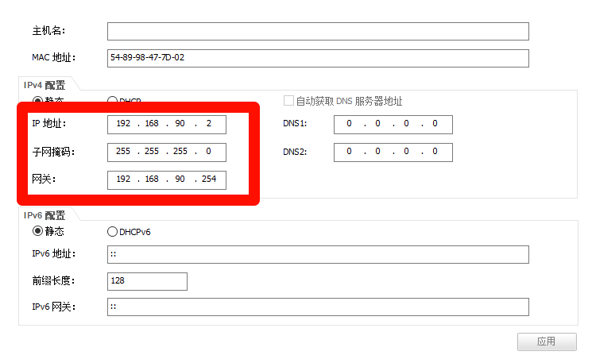

```PowerShell
创建vlan
vlan batch 90 200

链路聚合
sy
interface Eth-Trunk 1
port link-type trunk 
port trunk allow-pass vlan all  
mode lacp
q
interface GigabitEthernet 0/0/23
eth-trunk 1
interface GigabitEthernet 0/0/24
eth-trunk 1

vlan接入(所有汇聚链接终端的接口)
[HJ-FBSW01]interface GigabitEthernet 0/0/2      
[HJ-FBSW01-GigabitEthernet0/0/2]port link-type access       
[HJ-FBSW01-GigabitEthernet0/0/2]port default vlan 90

交换机与交换机之间配置trunk
[HX-FBSW01]interface GigabitEthernet 0/0/1       
[HX-FBSW01-GigabitEthernet0/0/1]port link-type trunk        
[HX-FBSW01-GigabitEthernet0/0/1]port trunk allow-pass vlan all

interface GigabitEthernet 0/0/2      
port link-type trunk        
port trunk allow-pass vlan all

配置MSTP
stp region-configuration         
region-name dxm
revision-level 10
instance 1 vlan 90 200
active region-configuration 

[HX-SW01]stp instance 1 root primary         
[HX-SW02]stp instance 1 root secondary 

配置VRRP
HX01
interface Vlanif 90
ip add 192.168.90.254 24
vrrp vrid 9 virtual-ip 192.168.90.254
vrrp vrid 9 priority 130
HX02
interface Vlanif 90
ip add 192.168.90.253 24
vrrp vrid 9 virtual-ip 192.168.90.254

配置OSPF
配置IP

ospf 1 router-id 8.8.8.8
 area 0.0.0.0
  network 8.8.8.8 0.0.0.0
  network 192.168.200.0 0.0.0.255
  authentication-mode simple plain 123456
  
int vlan 200
    ospf dr-priority 50
    ospf timer hello 4
```

### 二十五、分部搭建——解决vlan冲突

```PowerShell
删除vlan 200与三层接口
[HX-FBSW01]interface vlan 200
[HX-FBSW01-Vlanif200]undo ip address 192.168.200.7 255.255.255.0
[HX-FBSW01-Vlanif200]undo ospf dr-priority
[HX-FBSW01-Vlanif200]undo ospf timer hello
[HX-FBSW01]undo interface vlan 200
[HX-FBSW01]undo vlan 200

创建vlan102并配置三层接口
vlan 102
interface Vlanif102
 ip address 192.168.102.8 255.255.255.0
 ospf dr-priority 50
 ospf timer hello 4

MSTP删除200加入102
stp region-configuration         
region-name dxm
revision-level 10
undo instance 1 vlan 200
instance 1 vlan 90 102
active region-configuration 

ospf中undo掉200网段再加入102网段
ospf 1
    area 0
        undo network 192.168.200.0 0.0.0.255
        network 192.168.102.0 0.0.0.255
```

### 二十六、防火墙——配置IP和信任域

```PowerShell
修改密码
Username:admin
Password:Admin@123
The password needs to be changed. Change now? [Y/N]: y
Please enter old password: Admin@123
Please enter new password: Huawei@123
Please confirm new password: Huawei@123

配置IP地址
配置信任区域
（Untrust、DMZ、Trust、Local）
[ZB-FW01]firewall zone trust        
[ZB-FW01-zone-trust]add interface GigabitEthernet 1/0/0
[ZB-FW01-zone-trust]add interface GigabitEthernet 1/0/6     
[ZB-FW01]firewall zone untrust       
[ZB-FW01-zone-untrust]add interface GigabitEthernet 1/0/1

配置交换机的IP
[HX-SW01]vlan 103  
[HX-SW01]interface vlan 103
[HX-SW01-Vlanif103]ip add 192.168.103.3 24
[HX-SW01-Vlanif103]ospf dr-priority 50
[HX-SW01-Vlanif103]ospf timer hello 4

[HX-SW01]interface GigabitEthernet 0/0/5       
[HX-SW01-GigabitEthernet0/0/5]port link-type access       
[HX-SW01-GigabitEthernet0/0/5]port default vlan 103

防火墙放行ping策略
[ZB-FW01]interface GigabitEthernet 1/0/1
[ZB-FW01-GigabitEthernet1/0/1]service-manage ping permit
```

### 二十七、防火墙——web访问防火墙

创建云

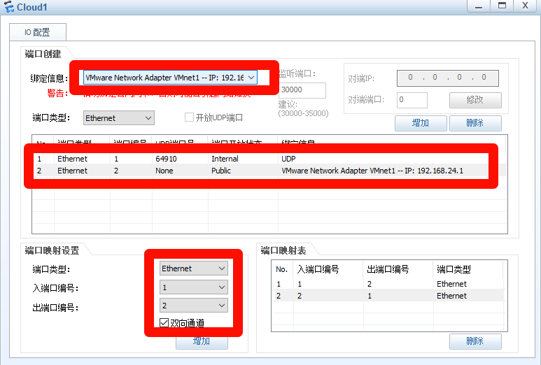

```PowerShell
云桥接防火墙
进入防火墙0/0/0接口配置IP并放行http与https协议
[ZB-FW01]interface GigabitEthernet 0/0/0
[ZB-FW01-GigabitEthernet0/0/0]ip add 192.168.24.2 24      
[ZB-FW01-GigabitEthernet0/0/0]service-manage all permit 
```

从自己的电脑上用web进行IP访问

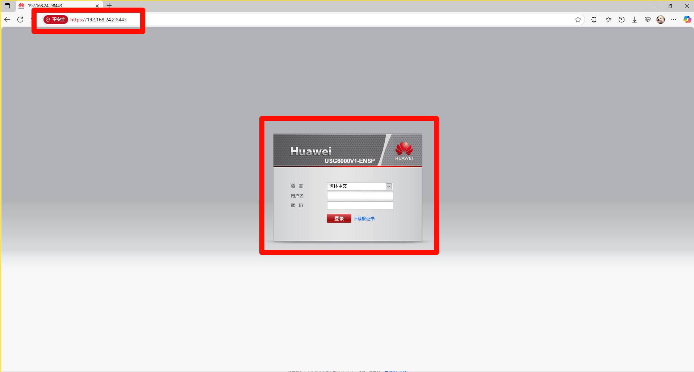

### 二十八、防火墙——VRRP配置

```PowerShell
在总部FW01上配置VRRP
 [ZB-FW01]interface GigabitEthernet 1/0/1      
 [ZB-FW01-GigabitEthernet1/0/1]vrrp vrid 110 virtual-ip 202.113.110.20 active 
 [ZB-FW01]interface GigabitEthernet 1/0/0      
 [ZB-FW01-GigabitEthernet1/0/0]vrrp vrid 103 virtual-ip 192.168.103.5 active 
在总部FW02上配置VRRP
 [ZB-FW02]interface GigabitEthernet 1/0/1      
 [ZB-FW02-GigabitEthernet1/0/1]vrrp vrid 110 virtual-ip 202.113.110.20 standby 
 [ZB-FW02]interface GigabitEthernet 1/0/0      
 [ZB-FW02-GigabitEthernet1/0/0]vrrp vrid 103 virtual-ip 192.168.103.5 standby 
```

### 二十九、防火墙——默认路由

进入静态路由页面

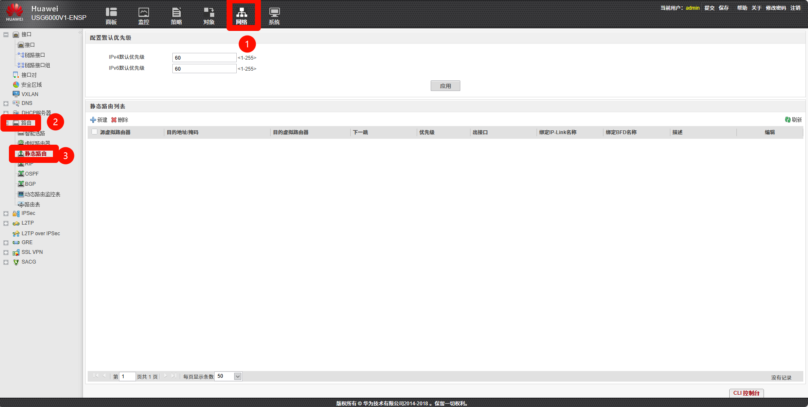

配置静态路由

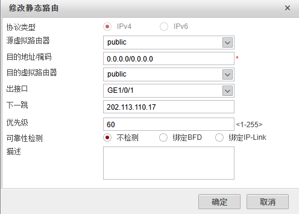

```PowerShell
ip route-static 0.0.0.0 0.0.0.0 GigabitEthernet1/0/1 202.113.110.17
```

### 三十、防火墙——OSPF配置

> 核心1与防火墙2始终ping不通，可以通过试着把vlan103加入MSTP中解决
>
> stp region-configuration
>
>  region-name dxm
>
>  revision-level 10
>
>  instance 1 vlan 10 20 30 40 100 103 200 to 204
>
>  instance 2 vlan 50 60 70 80 101 205 to 208
>
>  active region-configuration

```PowerShell
用命令敲
web界面配置的话会有一些参数跟核心交换机中的参数不一样
可能就无法建立OSPF邻

1. 在核心交换机上宣告103网段
核心交换机1
[HX-SW01]ospf 1     
[HX-SW01-ospf-1]area 0       
[HX-SW01-ospf-1-area-0.0.0.0]network 192.168.103.0 0.0.0.255
     
[HX-SW01]interface vlan 103       
[HX-SW01-Vlanif103]ospf dr-priority 100       
[HX-SW01-Vlanif103]ospf timer hello 4
核心交换机2
[HX-SW02]ospf 1     
[HX-SW02-ospf-1]area 0       
[HX-SW02-ospf-1-area-0.0.0.0]network 192.168.103.0 0.0.0.255
     
[HX-SW02]interface vlan 103          
[HX-SW02-Vlanif103]ospf timer hello 4

2. 在防火墙上用同样的参数宣告所有网段（尤其是默认路由）进入OSPF
[ZB-FW01]ospf 1 router-id 9.9.9.9   
[HX-SW02-ospf-1]area 0  
[ZB-FW01-ospf-1-area-0.0.0.0]network 192.168.24.0 0.0.0.255     
[ZB-FW01-ospf-1-area-0.0.0.0]network  192.168.103.0 0.0.0.255
[ZB-FW01-ospf-1-area-0.0.0.0]network 192.168.66.0 0.0.0.255  
[ZB-FW01-ospf-1-area-0.0.0.0]authentication-mode simple plain 123456    
[ZB-FW01-ospf-1-area-0.0.0.0]q     
[ZB-FW01-ospf-1]default-route-advertise
[ZB-FW01-GigabitEthernet0/0/0]ospf timer hello 4
[ZB-FW01-GigabitEthernet1/0/0]ospf timer hello 4
[ZB-FW01-GigabitEthernet1/0/1]ospf timer hello 4

ospf 1 router-id 10.10.10.10  
area 0  
network 192.168.24.0 0.0.0.255     
network  192.168.103.0 0.0.0.255
network 192.168.66.0 0.0.0.255  
net 10.10.10.10 0.0.0.0
authentication-mode simple plain 123456    
q     
default-route-advertise
[ZB-FW01-GigabitEthernet0/0/0]ospf timer hello 4
[ZB-FW01-GigabitEthernet1/0/0]ospf timer hello 4
[ZB-FW01-GigabitEthernet1/0/6]ospf timer hello 4
```

### 三十一、防火墙——NAT基础配置

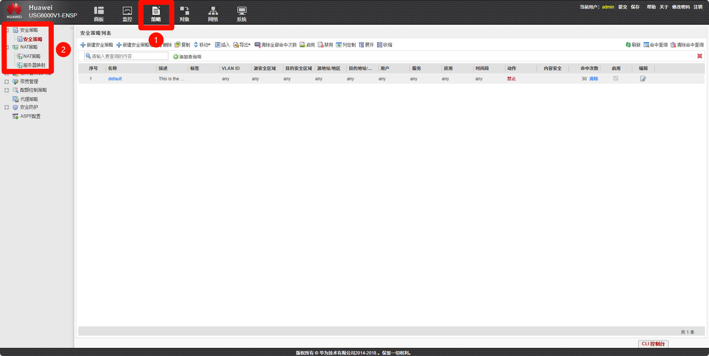

把防火墙安全策略临时改为允许

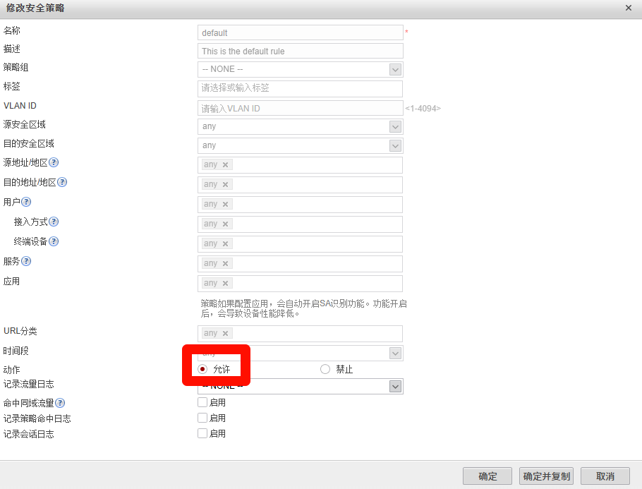

创建地址池

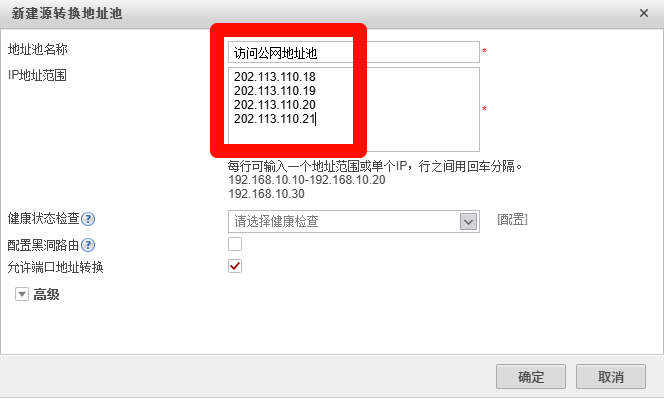

配置NAT策略

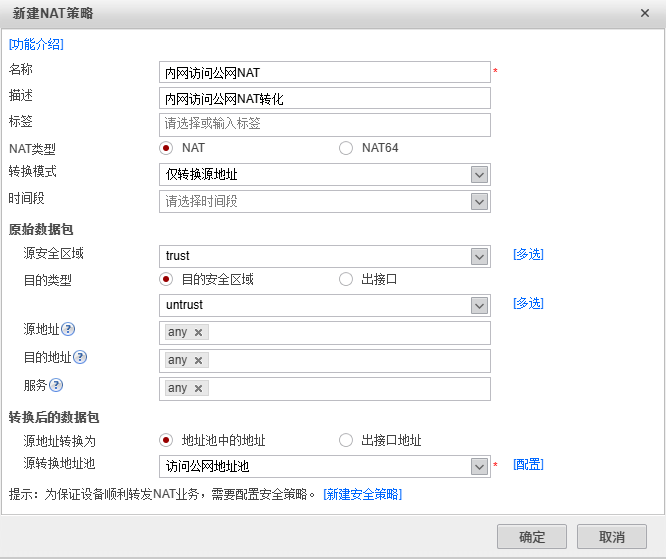

```PowerShell
security-policy
 default action permit

nat address-group 访问公网地址池 0
 mode pat
 section 0 202.113.110.18 202.113.110.18
 section 1 202.113.110.19 202.113.110.19
 section 2 202.113.110.20 202.113.110.20
 section 3 202.113.110.21 202.113.110.21
 
nat-policy
 rule name 内网访问公网NAT
  description 内网访问公网NAT转化
  source-zone trust
  destination-zone untrust
  action source-nat address-group 访问公网地址池
```

### 三十二、防火墙——配置双机热备

进入双机热备配置

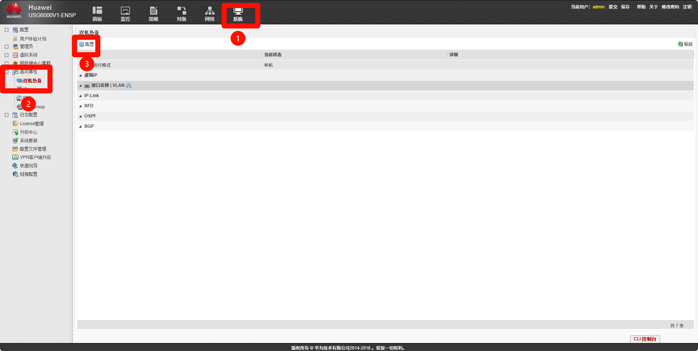

配置主备备份

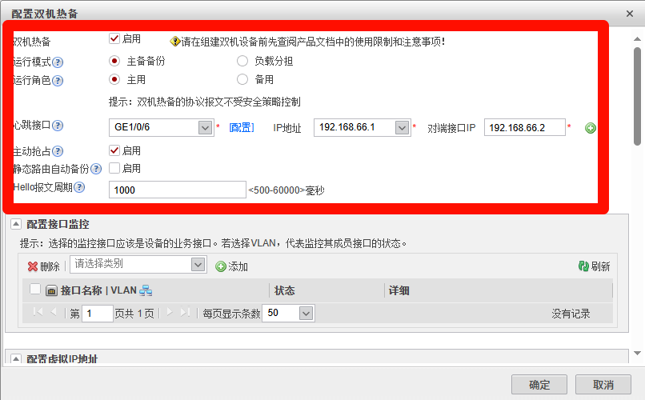

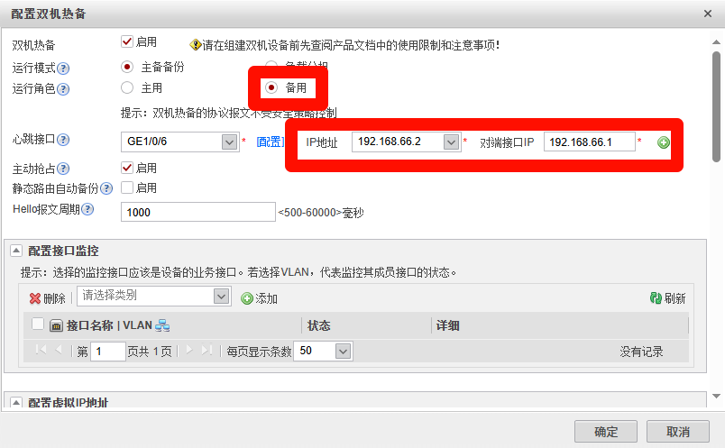

检查状态

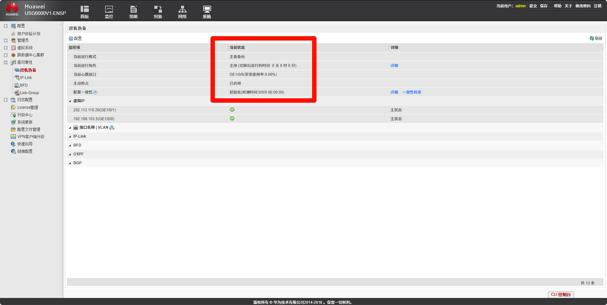

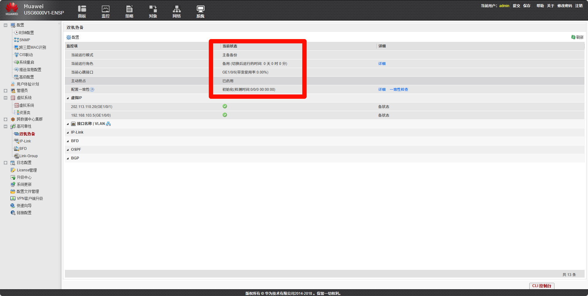

检查一致性

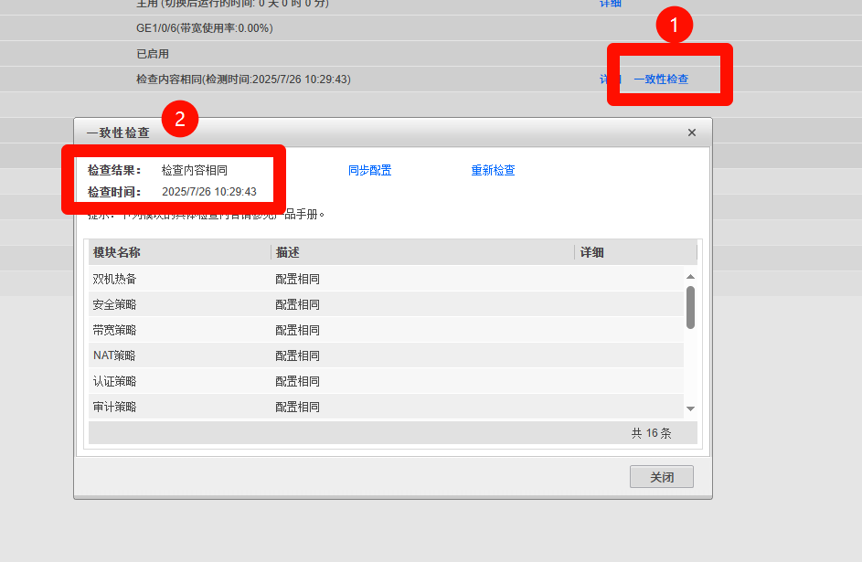

### 三十三、防火墙——分部防火墙基础配置

```PowerShell
配置默认路由
ip route-static 0.0.0.0 0.0.0.0 GigabitEthernet1/0/2 202.113.111.17
```

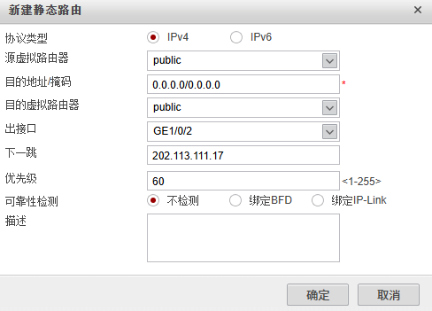

```PowerShell
配置OSPF
分部核心01
[HX-FBSW01-ospf-1-area-0.0.0.0]display this
#
 area 0.0.0.0
  authentication-mode simple plain 123456
  network 7.7.7.7 0.0.0.0
  network 192.168.102.0 0.0.0.255
  network 192.168.90.0 0.0.0.255
  network 192.168.104.0 0.0.0.255
#
interface Vlanif90
 ospf dr-priority 50
 ospf timer hello 4
#
interface Vlanif102
 ospf dr-priority 50
 ospf timer hello 4
#
interface Vlanif104
 ospf dr-priority 50
 ospf timer hello 4
#
分部核心02
[HX-FBSW02-ospf-1-area-0.0.0.0]display this
#
 area 0.0.0.0
  authentication-mode simple plain 123456
  network 8.8.8.8 0.0.0.0
  network 192.168.102.0 0.0.0.255
  network 192.168.90.0 0.0.0.255
  network 192.168.105.0 0.0.0.255
#
interface Vlanif90
 ip address 192.168.90.253 255.255.255.0
 vrrp vrid 9 virtual-ip 192.168.90.254
 ospf timer hello 4
#
interface Vlanif102
 ip address 192.168.102.8 255.255.255.0
 ospf dr-priority 50
 ospf timer hello 4
#
interface Vlanif105
 ip address 192.168.105.2 255.255.255.0
 ospf timer hello 4
#
分部防火墙
[FB-FW01-ospf-1]display this
#
ospf 1 router-id 11.11.11.11
 default-route-advertise
 area 0.0.0.0
  authentication-mode simple plain 123456
  network 192.168.24.0 0.0.0.255
  network 192.168.104.0 0.0.0.255
  network 192.168.105.0 0.0.0.255
#
interface GigabitEthernet0/0/0
 ospf timer hello 4
#
interface GigabitEthernet1/0/0
 ospf timer hello 4
#
interface GigabitEthernet1/0/1
 ospf timer hello 4
#
interface GigabitEthernet1/0/2
 ospf timer hello 4
#
```

NAT配置

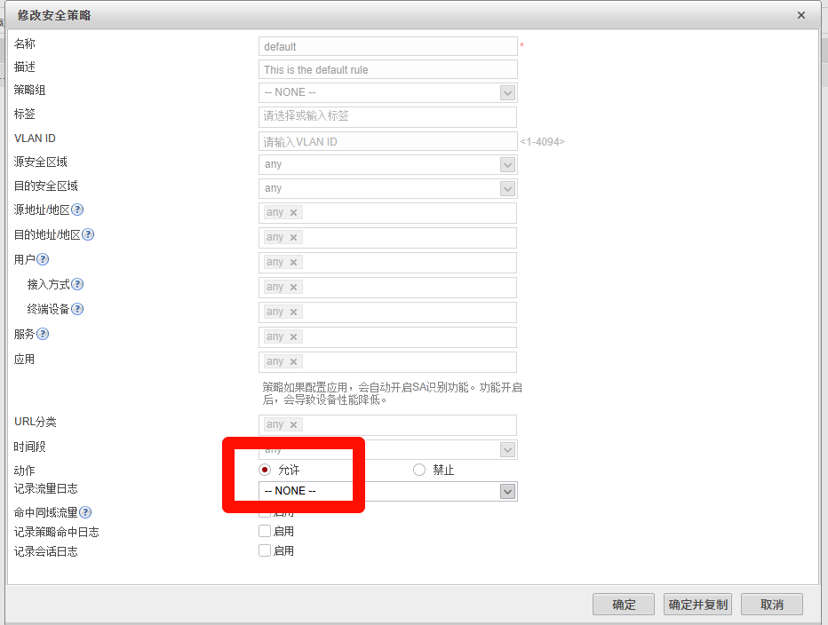

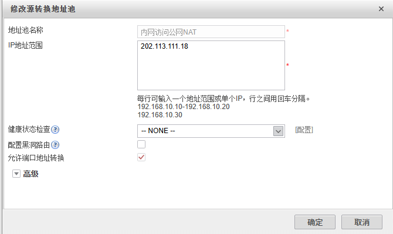

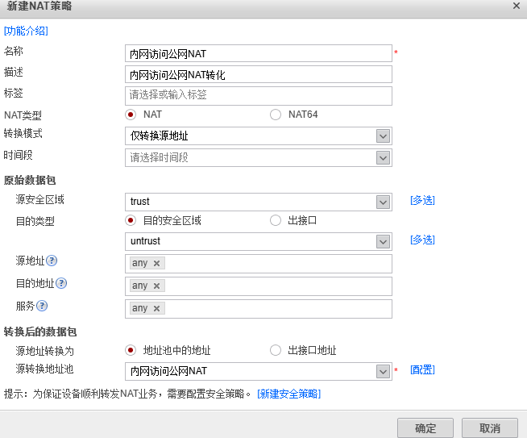

测试

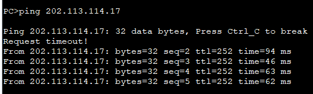

### 三十四、防火墙——IPsec VPN基础配置

进入IPsec列表

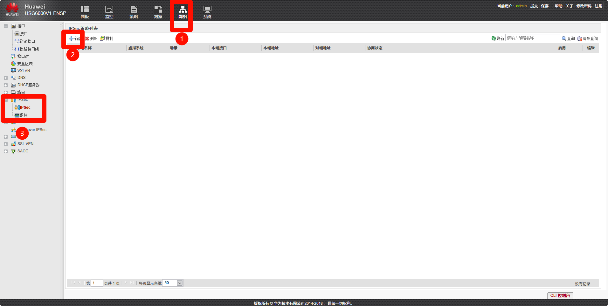

配置基础信息

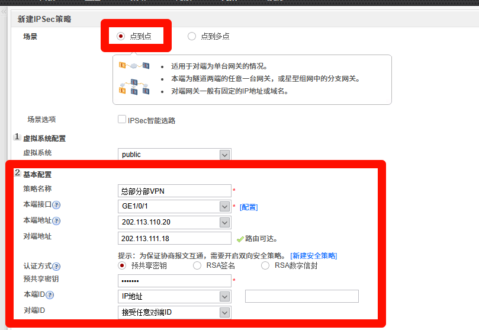

创建分部地址池

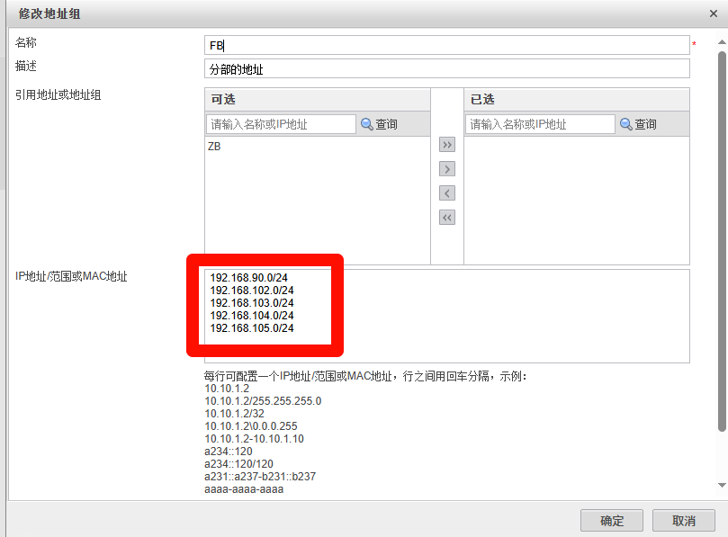

配置加密数据流

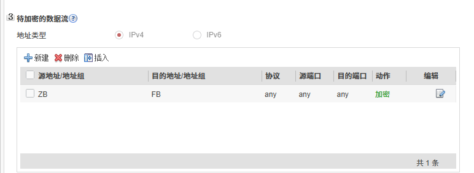

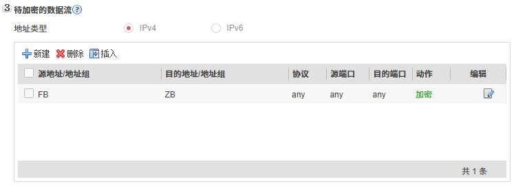

IPsec诊断

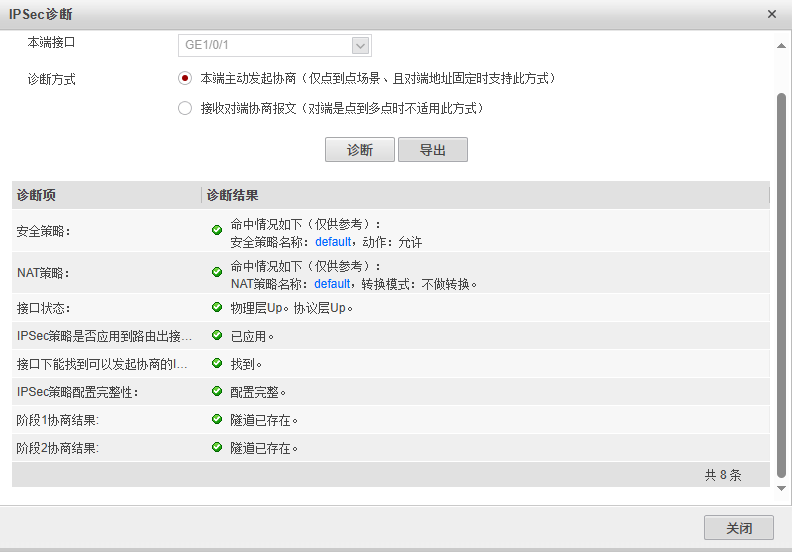

### 三十五、防火墙——GRE over IPsec

新建GRE接口

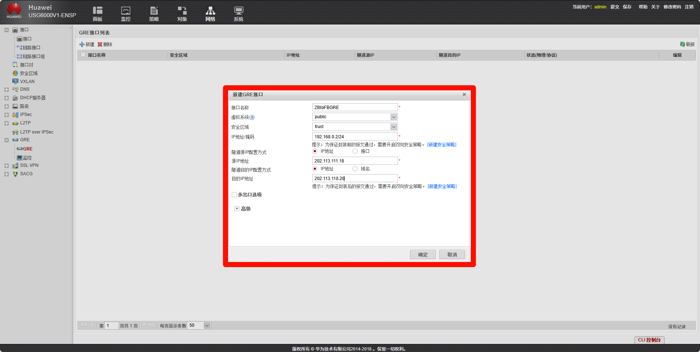

在IPsec中新建加密数据流

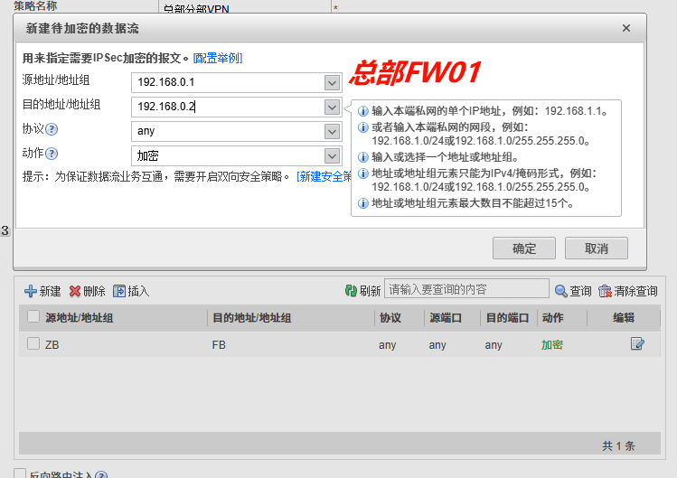

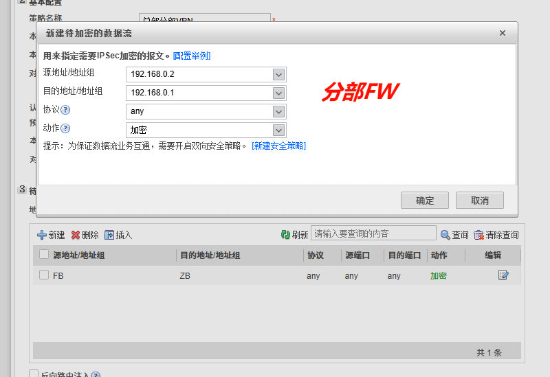

在OSPF中宣告192.168.0.0/24网段

```Python
HRP_M[ZB-FW01]ospf 1      
HRP_M[ZB-FW01-ospf-1]area 0      
HRP_M[ZB-FW01-ospf-1-area-0.0.0.0]network 192.168.0.0 0.0.0.255   
HRP_M[ZB-FW01]interface Tunnel 0 (+B)
HRP_M[ZB-FW01-Tunnel0]ospf dr-priority 100        
HRP_M[ZB-FW01-Tunnel0]ospf timer hello 4

[FB-FW01]ospf 1       
[FB-FW01-ospf-1]area 0      
[FB-FW01-ospf-1-area-0.0.0.0]network 192.168.0.0 0.0.0.255
[FB-FW01]interface Tunnel 0   
[FB-FW01-Tunnel0]ospf timer hello 4
```

查看路由表

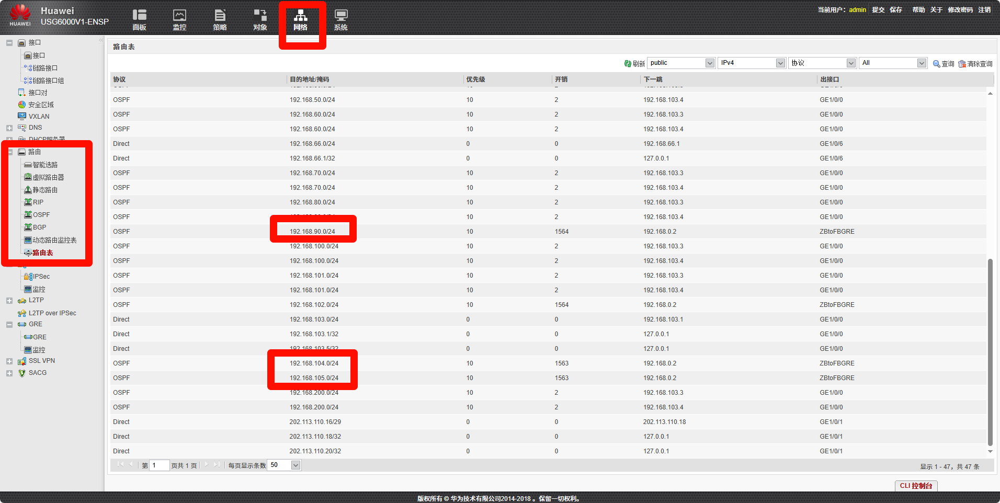


排错

在总部的地址组中加入200网段

测试

### 三十六、服务器——客户端接入以及IP配置

增加了终端，配置静态IP，并进行接入

```PowerShell
所有交换机做配置
[JR-SW02]interface Ethernet 0/0/4       
[JR-SW02-Ethernet0/0/4]port link-type access    
[JR-SW02-Ethernet0/0/4]port default vlan 20

interface Ethernet 0/0/4       
port link-type access    
port default vlan 60
```

配置服务器的IP

在HX-SW01上配置VLAN和IP，宣告进OSPF

```Go
[HX-SW01]vlan 106   
[HX-SW01]interface GigabitEthernet 0/0/6
[HX-SW01-GigabitEthernet0/0/6]port link-type access  
[HX-SW01-GigabitEthernet0/0/6]port default vlan 106    
[HX-SW01]interface vlan 106       
[HX-SW01-Vlanif106]ip add 10.1.106.2 24     
[HX-SW01-Vlanif106]ospf dr-priority 100       
[HX-SW01-Vlanif106]ospf timer hello 4
[HX-SW01]ospf 1      
[HX-SW01-ospf-1]area 0   
[HX-SW01-ospf-1-area-0.0.0.0]network 10.1.106.0 0.0.0.255
```

在防火墙上配置IP，信任域，并宣告ospf

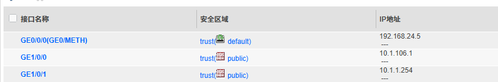

```PowerShell
[USG6000V1]ospf 1 router-id 12.12.12.12    
[USG6000V1-ospf-1]area 0
[USG6000V1-ospf-1-area-0.0.0.0]authentication-mode simple plain 123456  
[USG6000V1-ospf-1-area-0.0.0.0]network 10.1.1.0 0.0.0.255       
[USG6000V1-ospf-1-area-0.0.0.0]network 10.1.106.0 0.0.0.255
[USG6000V1]interface GigabitEthernet 1/0/0    
[USG6000V1-GigabitEthernet1/0/0]ospf timer hello 4
```

修改安全策略

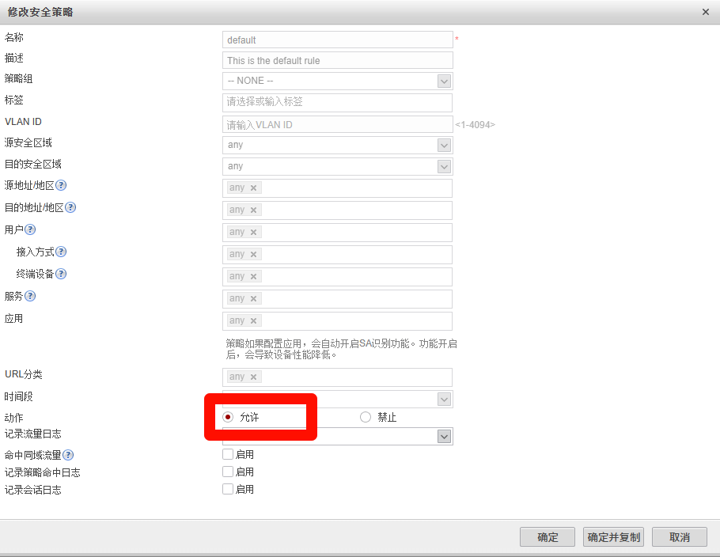

### 三十七、服务器——DHCP修改DNS与排除地址

1. 排除地址
2. 修改DNS

​      10.1.106.200

​      114.114.114.114

```PowerShell
[DHCP-Server]ip pool vlan10
[DHCP-Server-ip-pool-vlan10]excluded-ip-address 192.168.10.2
[DHCP-Server-ip-pool-vlan10]undo dns-list 8.8.8.8
[DHCP-Server-ip-pool-vlan10]dns-list 10.1.106.200    
[DHCP-Server-ip-pool-vlan10]dns-list 114.114.114.114

ip pool vlan200
excluded-ip-address 192.168.200.2
undo dns-list 8.8.8.8
dns-list 10.1.106.200    
dns-list 114.114.114.114
```

测试

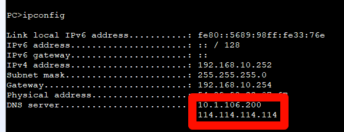

### 三十八、服务器——启动HTTP与DNS服务

（两个HTTP服务器和两个DNS服务器中的服务信息得完全相同）

启动HTTP服务

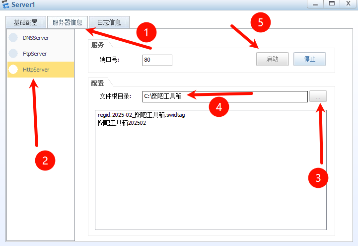

启动DNS服务

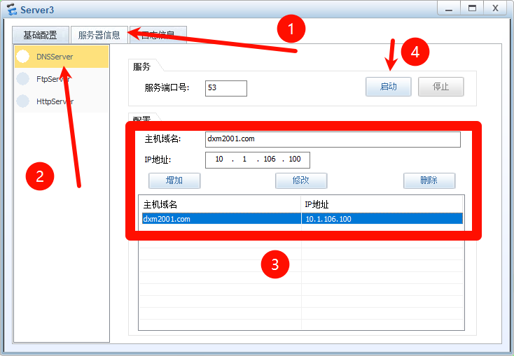

### 三十九、服务器——启动服务器轮询功能

进入实服务器组

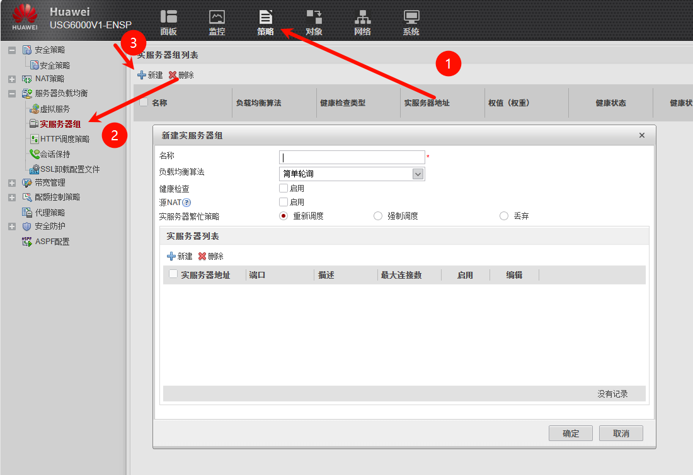

创建服务器组

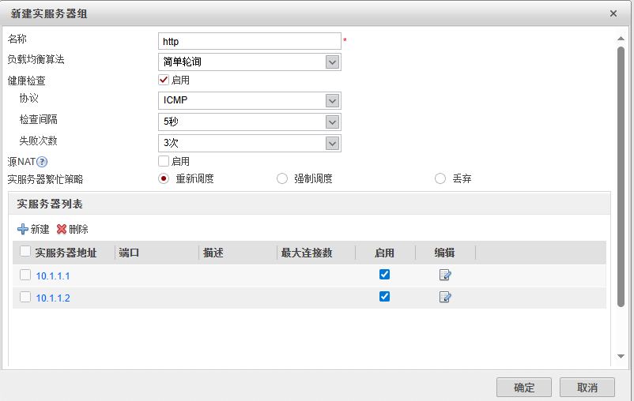

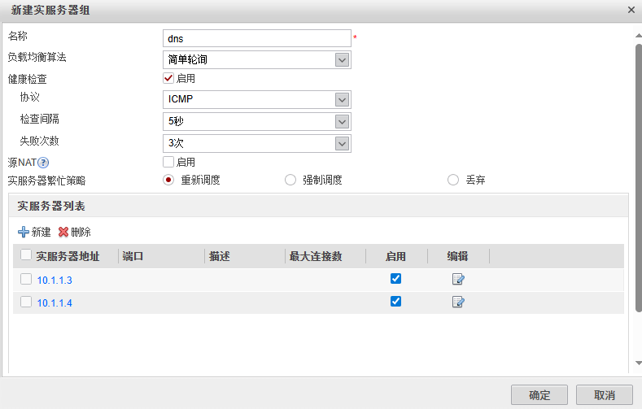

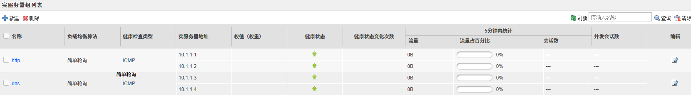

进入虚拟服务

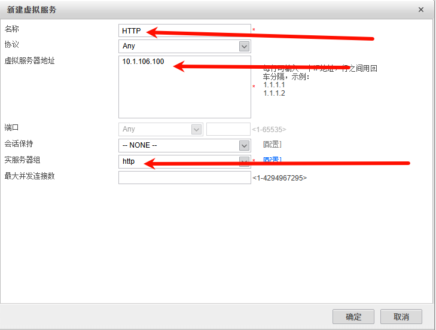

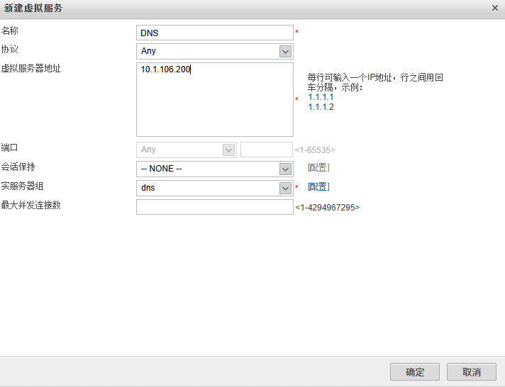

测试

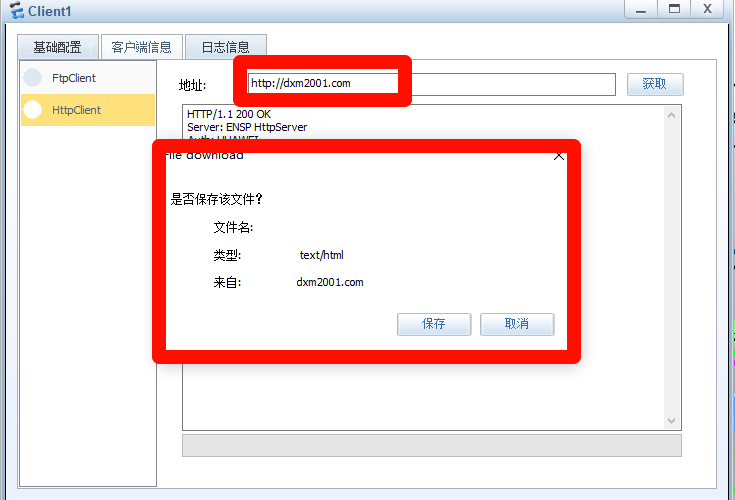

### 四十、服务器——配置NAT Server

进入NAT Server

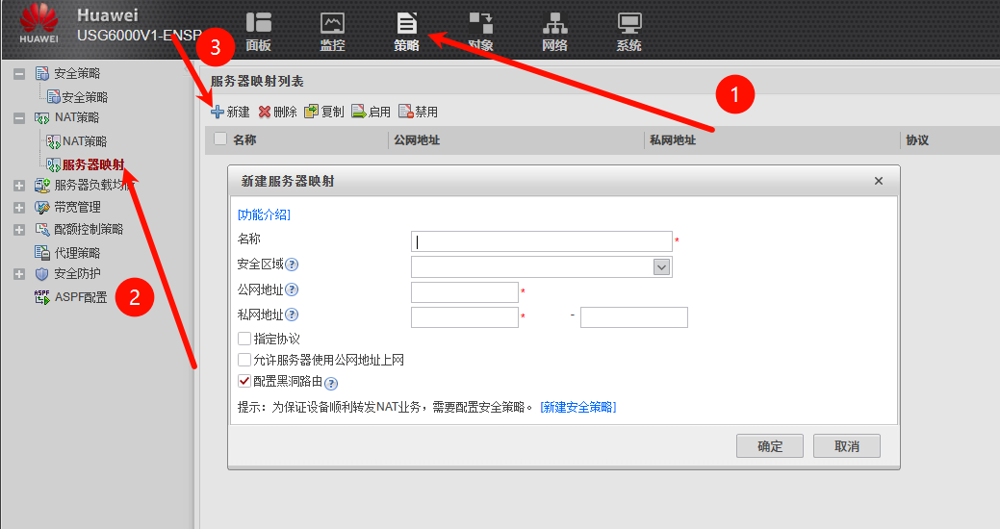

配置服务器映射

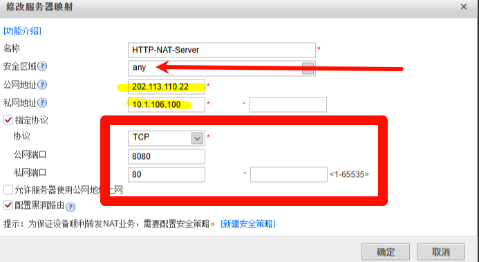

进行诊断

### 四十一、全网互通测试

1. NAT Server

配置外网测试节点

```PowerShell
interface GigabitEthernet0/0/2
[ISP-02-GigabitEthernet0/0/2]ip add 202.113.116.18 255.255.255.252
[ISP-02-GigabitEthernet0/0/2]rip authentication-mode simple plain a12345678       
[ISP-02]rip 1       
[ISP-02-rip-1]network 202.113.116.0
```

测试（注意端口）

1. 全网互通

错误1：70网段sta终端ping80网段不通

```PowerShell
80网段的终端未获取IP

DHCP服务器配置无误
ip pool vlan80
 gateway-list 192.168.80.254 
 network 192.168.80.0 mask 255.255.255.0 
 excluded-ip-address 192.168.80.1 192.168.80.2 
 excluded-ip-address 192.168.80.253 
 dns-list 10.1.106.200 114.114.114.114 


接入层MSTP配置无误
stp region-configuration
 region-name dxm
 revision-level 10
 instance 1 vlan 10 20 30 40 100 200
 instance 2 vlan 50 60 70 80 101
 active region-configuration    
<JR-SW08>display stp brief 
 MSTID  Port                        Role  STP State     Protection
   0    Ethernet0/0/1               ROOT  FORWARDING      NONE
   0    Ethernet0/0/2               ALTE  DISCARDING      NONE
   0    Ethernet0/0/3               DESI  FORWARDING      NONE


查看错误原因1：没有配置vlna
[JR-SW08-Ethernet0/0/3]display this
#
interface Ethernet0/0/3
#
return

修改：
[JR-SW08]vlan 80
[JR-SW08]interface Ethernet 0/0/3   
[JR-SW08-Ethernet0/0/3]port link-type access      
[JR-SW08-Ethernet0/0/3]port default vlan 80

错误原因2：1和2扣未配置trunk
#
interface Ethernet0/0/1
#
interface Ethernet0/0/2
#

修改：
[JR-SW08]interface Ethernet0/0/1     
[JR-SW08-Ethernet0/0/1]port link-type trunk        
[JR-SW08-Ethernet0/0/1]port trunk allow-pass vlan all
[JR-SW08]interface Ethernet0/0/2     
[JR-SW08-Ethernet0/0/2]port link-type trunk        
[JR-SW08-Ethernet0/0/2]port trunk allow-pass vlan all
```

80网段终端可以成功获取IP

70可以ping通80

错误2：70网段sta终端ping3.3.3.3不通

```PowerShell
查看错误原因1：OSPF未建立邻居
<HJ-SW01>display ospf peer brief 

         OSPF Process 1 with Router ID 3.3.3.3
                  Peer Statistic Information
 ----------------------------------------------------------------------------
 Area Id          Interface                        Neighbor id      State    
 ----------------------------------------------------------------------------
 查看错误原因2：VLANif100中hello发送间隔配置错误
 interface Vlanif100
 ip address 192.168.100.3 255.255.255.0
 ospf timer hello 44
 
 修改：
 undo ospf timer hello
 ospf timer hello 4
 
 邻居建立成功
 <HJ-SW01>display ospf peer brief 

         OSPF Process 1 with Router ID 3.3.3.3
                  Peer Statistic Information
 ----------------------------------------------------------------------------
 Area Id          Interface                        Neighbor id      State    
 0.0.0.0          Vlanif100                        1.1.1.1          2-Way       
 0.0.0.0          Vlanif100                        2.2.2.2          2-Way       
 0.0.0.0          Vlanif100                        4.4.4.4          2-Way       
 0.0.0.0          Vlanif100                        5.5.5.5          Full        
 0.0.0.0          Vlanif100                        6.6.6.6          Full        
 ----------------------------------------------------------------------------
```

可以ping通3.3.3.3

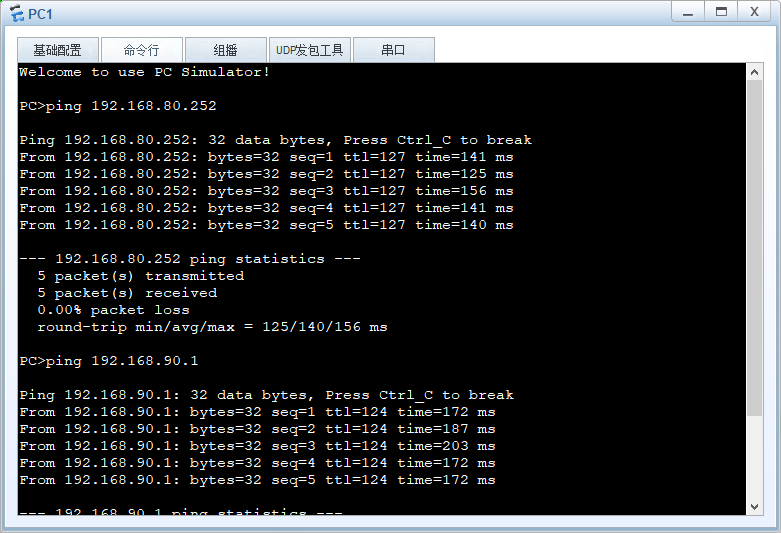


